# UTS-PWFP-PerpustakaanGramedia

- Dibuat untuk kepentingan **Ujian Tengah Semester Pemrograman Web**.
- Dibuat bersama kelompok (Ferry, Kelvin, Kevin)
- Autentikasi pengguna.
- Mengelolah data Buku
- Mengelolah data Peminjaman Buku
- Mengelolah data Pengguna / Anggota

Website ini dibuat menggunakan teknologi :
**_HTML, CSS, Bootstrap, Python, Flask, MySQL_**

# Tampilan Website

## Halaman Utama

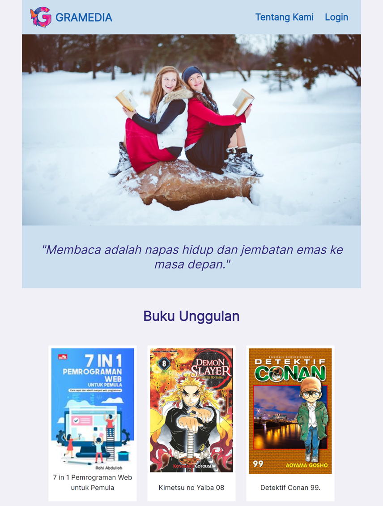
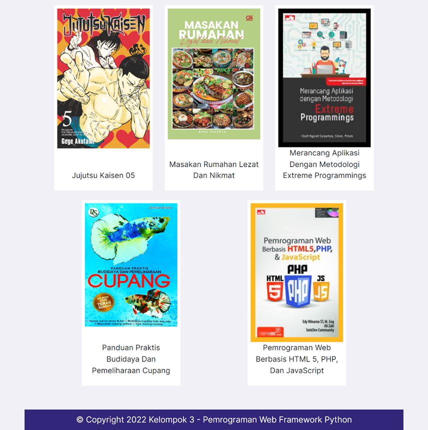

## Halaman Tentang Kami

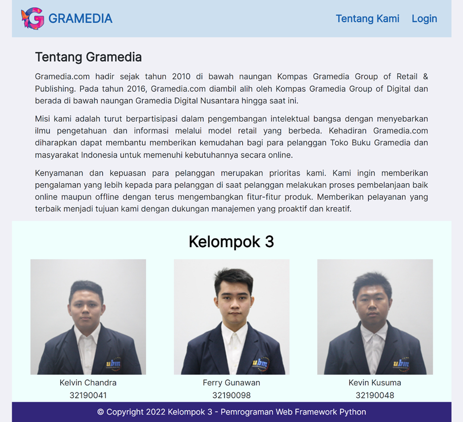

## Halaman Login

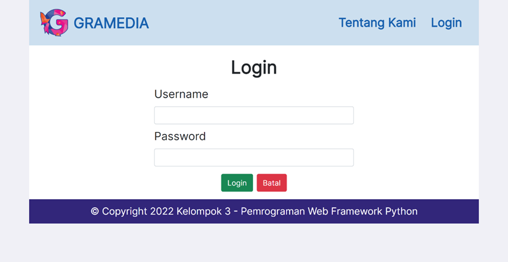

## Halaman Daftar Buku

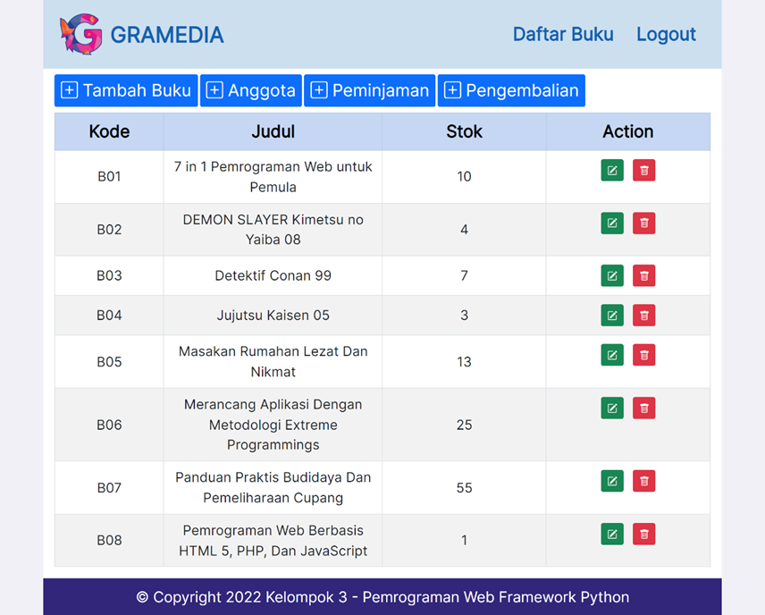

## Halaman Tambah Buku

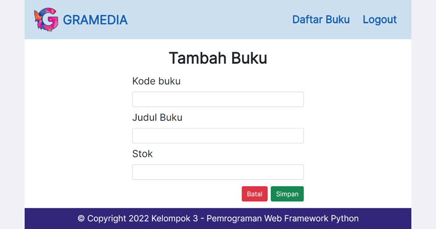

## Halaman Daftar Anggota

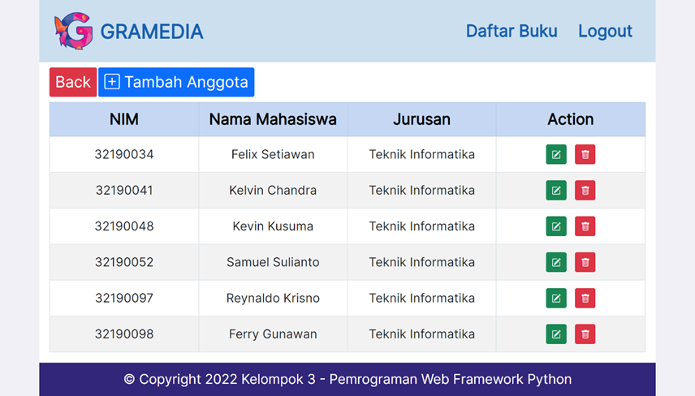

## Halaman Tambah Anggota

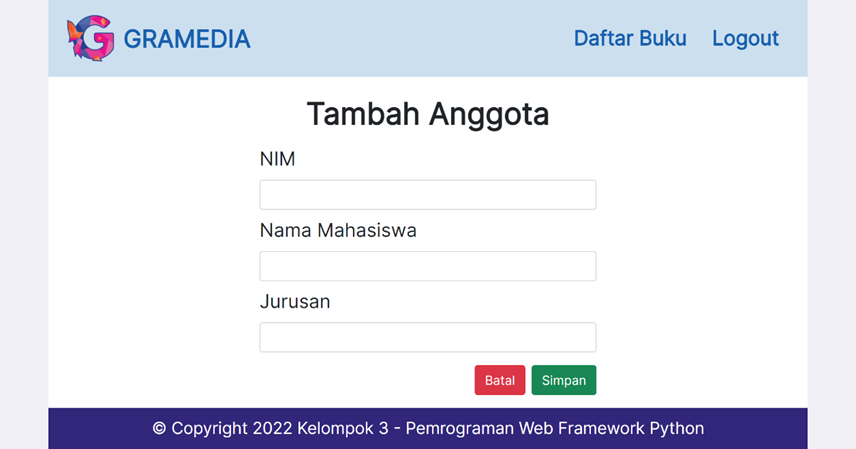

## Halaman Edit Anggota

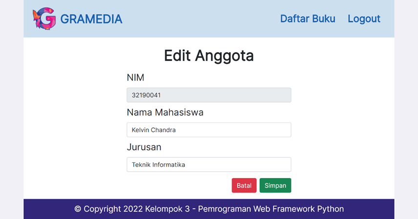

## Halaman Peminjaman

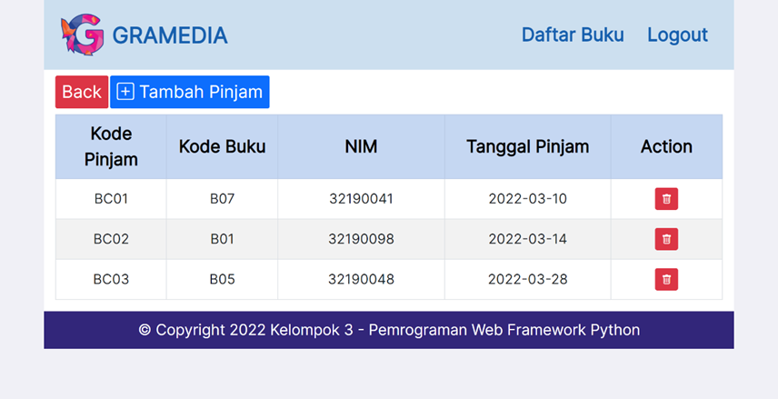

## Halaman Tambah Peminjaman

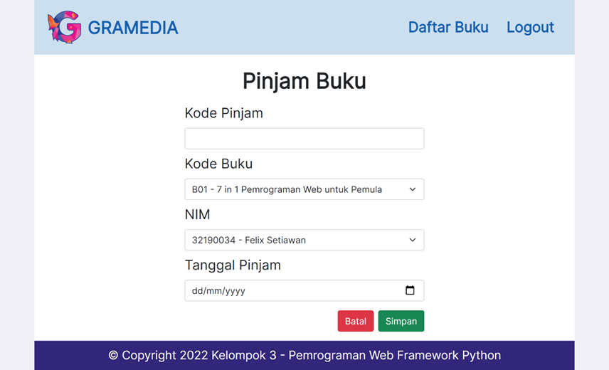

## Halaman Pengembalian

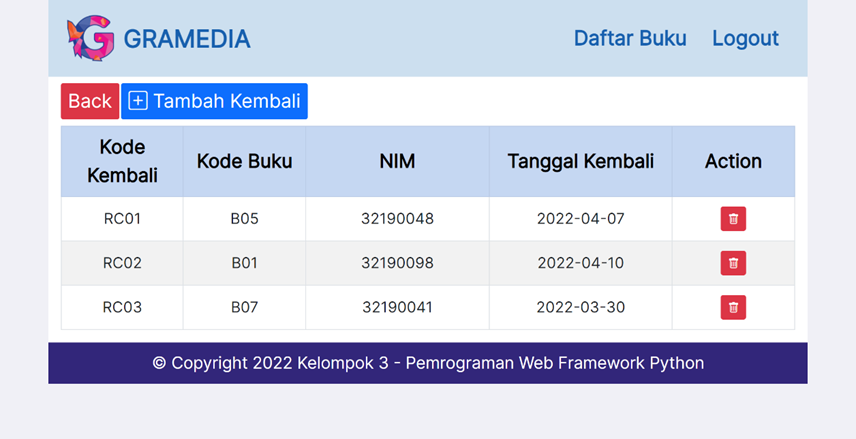

## Halaman Tambah Pengembalian

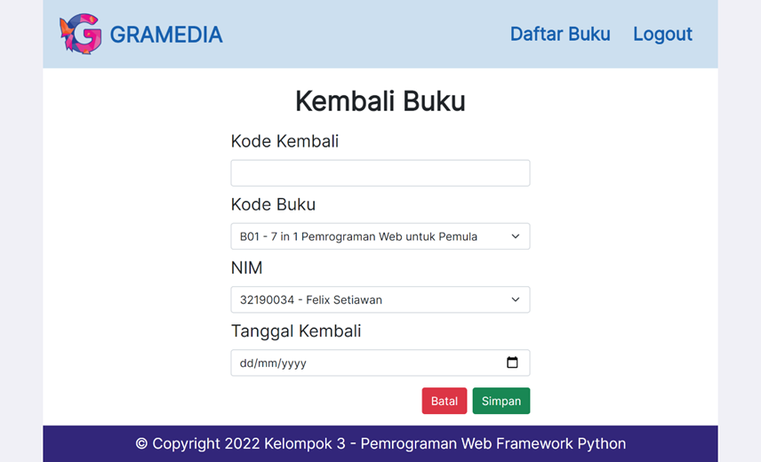
